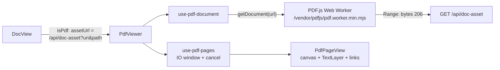

# fn-112-native-pdfjs-document-renderer Native PDF.js Document Renderer

## Overview

Build a genuinely app-native PDF renderer inside the existing `/doc` page of
GNO's web UI: pinned `pdfjs-dist` parsing in a same-origin Web Worker, our own
canvas + selectable-text-layer viewer styled as a first-class Scholarly Dusk
component (instrument-rail toolbar, page nav, zoom, fit modes), virtualized
page rendering with strict cancellation/memory bounds, extracted-text
fallback/toggle, and hardened `GET /api/doc-asset` serving (Range requests,
realpath containment). Entirely local/offline — no CDN, no framing relaxation,
no iframe/object/embed. Ingestion/indexing/extracted-text behavior untouched.

## Goal & Context
<!-- scope: business -->

GNO indexes PDFs but the `/doc` view can only show their extracted text in a
`<pre>` block. Users reading a paper, book chapter, or scanned report lose the
original layout, figures, tables, and typography — they must leave the app
("Open original" via `file://`) to actually read the document. A disposable
investigation (2026-07, `/tmp/gno-native-pdf-investigation`) proved the binary
can be served safely through the authenticated same-origin `GET /api/doc-asset`
endpoint, but its iframe-based UX was rejected: it looks like an embedded
browser viewer, requires relaxing `frame-ancestors`/`X-Frame-Options`, and
cannot match the Scholarly Dusk design language.

This spec builds a native PDF renderer inside the existing `/doc` page: PDF.js
(pinned `pdfjs-dist`, local worker, no CDN) parsing in a Web Worker, our own
canvas + text-layer viewer UI styled as a first-class GNO component. Entirely
local/offline. The extracted-text view remains available as a toggle and as
the fallback when rendering fails.

**Target user**: anyone browsing an indexed PDF in `gno serve` / the desktop
shell. **Single job of the surface**: read the original document without
leaving the app.

### Design direction (frontend-design pass, grounded in ADR-001 Scholarly Dusk)

The brief pins the visual direction: Scholarly Dusk, not a generic viewer
chrome. The palette, type roles, and tokens come from ADR-001 — no new colors,
no new fonts.

- **Concept**: an *examination stand* in the night library. Paper-white pages
  float on the recessed dark well (the existing content-inner treatment:
  `rounded-lg border border-border/40 bg-gradient-to-br from-background to-muted/10 shadow-inner`),
  each page canvas with a hairline `border-border/40` edge and a soft paper
  shadow. Pages are NOT color-inverted in dark theme — fidelity over theming;
  the dark surround does the atmospheric work (manuscripts under lamplight).
  In light theme ("Antique Paper") the well recedes to parchment and pages sit
  on it with the same hairline edges.
- **Signature element** (the one memorable thing): the *instrument rail* — a
  sticky glass toolbar (`bg-background/85 backdrop-blur`, hairline
  `border-border/40` bottom edge) whose controls use the established
  floating-pill vocabulary: `font-mono` microtype labels, `tabular-nums` page
  indicator rendered as `12 / 240` with the current page in `text-primary`,
  zoom readout as a mono percentage button (click = reset to 100%). Everything
  else stays quiet and disciplined.
- **Explicit rejections** (the templated defaults): Chrome-PDF-viewer grey
  chrome, Material toolbar with raised buttons, drop-shadowed white card
  container, page thumbnails sidebar (out of scope), purple/gradient anything.
- **Toolbar contents** (left → right): page navigation group (previous /
  next icon buttons, page-number input + `/ N` mono count), zoom group
  (zoom-out, mono `%` readout, zoom-in), fit-mode segmented mono pill
  (`Fit width` / `Fit page`), spacer, and a secondary download/open-original
  icon action. At `< lg` widths the fit-mode labels collapse to icons and the
  page input collapses to indicator-only; the rail wraps to two rows rather
  than overflowing (`flex-wrap`). **The `Pages` / `Text` view toggle is NOT a
  toolbar control** — it stays the existing DocView floating pill
  (`DocView.tsx:1583-1607`, `showRawView`) per R19 and task .5, and
  `PdfToolbar` must not render a second one (see "View-toggle ownership"
  below).
- **Fit mode has three states, two segments**: `FitMode = "width" | "page" |
  "custom"` (`hooks/use-pdf-pages.ts`). The rail renders exactly two
  segments; an explicit zoom commit (zoom in/out, `%` reset, `+`/`-`/`0`)
  sets `fitMode: "custom"` and leaves **both** segments unpressed
  (`aria-pressed="false"`). Selecting a segment sets that fit mode.
- **Copy register**: plain verbs, sentence case. Errors state what happened
  and what to do; they never apologize, are never vague, and never surface
  exception text or error codes. The two register strings fixed at plan
  approval are preserved byte-exact: `Preparing document…` (U+2026, not three
  dots) and `This PDF could not be rendered. View the extracted text or
  download the original.` The complete canonical per-state copy is the table
  in "Canonical state copy" below — implementations use those strings exactly
  and invent none.

#### Canonical state copy (task .4; no other strings permitted)

Every state renders an uppercase mono eyebrow (ADR-001 micro label), one body
sentence, and its action set. `Try again` re-issues the load
(`usePdfDocument().retry`); `Download original` is the `downloadUrl` anchor.
Action labels are fixed and identical wherever they appear.

| State | Test hook | Eyebrow | Body copy | Actions |
| --- | --- | --- | --- | --- |
| Loading | `pdf-state-loading` | `LOADING` | `Preparing document…` | none |
| Progressive | **exempt from `pdf-state-*`** — see "Progressive state hook" below | — | **no copy**: pending pages are aspect-correct `PdfPageView` placeholders only, never a text state | none |
| Empty / zero-page | `pdf-state-empty` | `EMPTY DOCUMENT` | `This PDF has no pages.` | `Download original` |
| Corrupt / invalid | `pdf-state-corrupt` | `CANNOT RENDER` | `This PDF could not be rendered. Download the original to read it.` | `Try again`, `Download original` |
| Password-protected | `pdf-state-password` | `PASSWORD PROTECTED` | `This PDF is password protected. Download the original to open it in a PDF reader.` | `Download original` (no `Try again` — retry cannot help) |
| Auth / network | `pdf-state-network` | `COULD NOT LOAD` | `The document could not be loaded from this session. Try again, or download the original.` | `Try again`, `Download original` |
| Worker bootstrap failure | `pdf-state-bootstrap` | `VIEWER UNAVAILABLE` | `The PDF viewer could not start in this window. Download the original to read it.` | `Try again`, `Download original` |

**Where the second verbatim register string lives.** The viewer's own error
cards are only reachable when `extractedTextAvailable === false` (otherwise
`onFallback(reason)` fires and DocView owns the surface), so a card must not
tell the reader to view extracted text that does not exist. The approved
register string `This PDF could not be rendered. View the extracted text or
download the original.` is therefore preserved byte-exact as the canonical
**corrupt-reason fallback notice** copy in DocView (task .5), where extracted
text is by definition available; the viewer's corrupt card carries the
no-extracted-text variant in the table above. Neither string may be reworded.

#### `extractedTextAvailable` — exact predicate (single definition)

`DocView` computes it from the already-fetched `DocData`
(`DocView.tsx:78-92`: `content: string | null`, `contentAvailable: boolean`)
and passes it to `PdfViewer`. Byte-exact, executable, no other reading:

```
const extractedTextAvailable =
  doc.contentAvailable === true &&
  typeof doc.content === "string" &&
  doc.content.trim().length > 0;
```

Consequences, binding on tasks .4, .5, and .6:

- Fallback **never** fires for a null, empty, or whitespace-only extracted
  text — including every scanned PDF. Those documents keep the viewer's own
  error card on `Pages`, which stays actionable (`Try again` +
  `Download original`).
- The "No extracted text for this document." sub-state is therefore reachable
  **only** when the user manually selects `Text` on a scanned/empty PDF. It is
  never combined with a fallback notice, and no artifact may require that
  combination.
- The predicate is evaluated per render from `doc`; it is not cached, not
  derived from mime/ext, and does not consider frontmatter.

#### Canonical fallback-notice copy (task .5; DocView Text branch)

Rendered above the extracted text when `pdfFallbackReason !== null`. Distinct
from the viewer's error cards in "Canonical state copy" — those two surfaces
are mutually exclusive by construction (a card only exists when the predicate
is false; a notice only when it is true). Same eyebrow/body/action shape as
the cards, no `Card` chrome, `role="status"`.

| Reason | Test hook | Eyebrow | Body copy | Actions |
| --- | --- | --- | --- | --- |
| `corrupt` | `pdf-fallback-corrupt` | `CANNOT RENDER` | `This PDF could not be rendered. View the extracted text or download the original.` | `Download original` |
| `password` | `pdf-fallback-password` | `PASSWORD PROTECTED` | `This PDF is password protected. Showing the extracted text instead. Download the original to open it in a PDF reader.` | `Download original` |
| `network` | `pdf-fallback-network` | `COULD NOT LOAD` | `The document could not be loaded from this session. Showing the extracted text instead. Switch to Pages to try again, or download the original.` | `Download original` |
| `bootstrap` | `pdf-fallback-bootstrap` | `VIEWER UNAVAILABLE` | `The PDF viewer could not start in this window. Showing the extracted text instead. Download the original to read it.` | `Download original` |

- The `corrupt` string is the approved register string, byte-exact; it is the
  only place that string appears in the product.
- **Action set is exactly one control per notice: `Download original`.** No
  retry button lives in the notice — retrying means switching back to `Pages`,
  which the existing `showRawView` pill already does and which is the same
  action that clears the notice. Adding a second control would give the reader
  two paths to one behavior and would need state the toggle contract does not
  have. The `network` copy names that path in words instead.
- Exactly one `pdf-fallback-*` node may exist at a time, and never together
  with any `pdf-state-*` node.

#### Progressive state hook (explicit exemption)

Progressive is a rendering *phase* of the ready document, not a state card. It
has no copy, no card, no eyebrow, and **no `pdf-state-*` test id** — adding one
would contradict the table above. Wherever this spec or a task says "every
designed state carries a stable test hook", Progressive is exempt from the
`pdf-state-*` form and satisfies the requirement through the page-column hooks
below instead. The seven-state list is unchanged; only the hook *shape* differs
for this one entry.

Its canonical, already-implemented hooks (task .3, `PdfPageView.tsx` +
`globals.css:540-556`):

- `data-testid="pdf-page-column"` — the scroll container (task .4).
- One node per page carrying `data-rendered="false"` while unrendered and
  `data-rendered="true"` once painted (the existing `.gno-pdf-page[data-rendered]`
  contract), plus the existing per-page test id.

**Deterministic progressive evidence (task .6).** Drive the large fixture with
Playwright `page.route()` delaying the `/api/doc-asset` **range** responses
(R18). The `Range`-less first request is passed through to the real endpoint
verbatim (genuine `200`, true `Content-Length`) — never truncated, never
answered with a `206`, never given a rewritten header — and the range-mode
loading policy below is what makes the remaining bytes arrive as observable,
holdable `Range` requests. Response *timing* is the only synthetic element.
Then assert, without sleeps:

1. `[data-testid="pdf-page-column"]` exists.
2. At least one `[data-rendered="true"]` node exists (first page painted).
3. **Simultaneously** at least one `[data-rendered="false"]` node exists
   (pending pages still placeholders) and that node has non-zero width/height
   matching its `getViewport` aspect — the layout-stability half of the state.
4. No `[data-testid^="pdf-state-"]` node is present — progressive is never a
   card.

Screenshot at that moment is the R8 progressive evidence artifact.

#### View-toggle ownership (single owner)

`DocView` is the sole owner of the `Pages` / `Text` control, via the existing
`showRawView` floating pill at `DocView.tsx:1583-1607` (R19, task .5).
`PdfViewer` takes no `showRawView`-like prop and `PdfToolbar` renders no view
toggle. A duplicated toggle in the rail is a defect, not a variant.

#### Keyboard arrow semantics (N4 preventDefault rule)

Viewer-scoped keys, active only when focus is inside the viewer container and
**not** inside the page-number input:

| Key(s) | Viewer behavior | `preventDefault()` |
| --- | --- | --- |
| `PageDown`, `ArrowRight` | next page | only when a next page exists and controls are enabled |
| `PageUp`, `ArrowLeft` | previous page | only when a previous page exists and controls are enabled |
| `+` / `=` , `-` | zoom in / out | only when the zoom actually changes (not at `MAX_ZOOM`/`MIN_ZOOM`) |
| `0` | reset zoom to 100% | only when it changes state |
| `ArrowUp`, `ArrowDown`, `Home`, `End`, `Space` | **not handled** — native scrolling of the page column | never |
| any key while focus is in the page-number input | not handled by the viewer (`Enter`/`Escape` are the input's own) | never (input-local keys excepted) |
| any key on a zero-page/disabled document | not handled | never |

Vertical arrows are deliberately left to the browser: the viewer scrolls
vertically, so claiming `ArrowUp`/`ArrowDown` would either double-move or
deaden scrolling. Horizontal arrows carry paging because nothing else uses
them.

## Architecture & Data Models
<!-- scope: technical -->

### Component / module boundaries (all new UI code under `src/serve/public/`)

| Path | Responsibility |
| --- | --- |
| `components/pdf/PdfViewer.tsx` | Top-level viewer: owns document lifecycle via hooks, renders toolbar + page list + loading/error/empty states. Lazy-loaded from DocView (mirror the `lazy()` + `Suspense` pattern at `src/serve/public/pages/GraphView.tsx:1-38`). |
| `components/pdf/PdfToolbar.tsx` | Instrument rail. Pure/controlled: receives page state, zoom state, fit mode, callbacks. No pdfjs imports. Composes `components/ui/*` primitives. Renders **no** `Pages`/`Text` view toggle — DocView owns that control (see "View-toggle ownership"). Two fit segments, both unpressed when `fitMode === "custom"`. The zoom group's percentage readout is a **zoom-level combobox** (`components/ui/select.tsx`, fixed stops within `MIN_ZOOM`/`MAX_ZOOM`, `onZoomTo` commit) — see the R4 addendum under P-4a; stepped `+`/`−` are unchanged. |
| `components/pdf/PdfPageView.tsx` | One page: canvas + text layer + link annotation layer, placeholder box (aspect ratio from `getViewport`, which already accounts for `/Rotate`) while unrendered. |
| `hooks/use-pdf-document.ts` | Loads/destroys the pdfjs document from a URL; exposes `{status, doc, numPages, firstPageReady, error}`; cancels + `loadingTask.destroy()` on unmount/URL change. Model lifecycle/cleanup on `hooks/use-doc-events.ts`. |
| `hooks/use-pdf-pages.ts` | Virtualization + render scheduling: visible-window tracking (IntersectionObserver), render-task issuing/cancelling, page cleanup/eviction, DPR + canvas-area cap. Window entry **schedules** a render; admission is deferred until the visible set is quiescent, with the first window of a doc and every `genId` commit exempt (see P-3's deferred-render-admission invariant). |
| `lib/pdf.ts` | pdfjs facade — the ONLY module in the codebase (runtime *and* type positions) allowed to reference `pdfjs-dist`. It: sets `GlobalWorkerOptions.workerSrc = "/vendor/pdfjs/pdf.worker.min.mjs"`, `cMapUrl = "/vendor/pdfjs/cmaps/"` (+ `cMapPacked: true`) and `standardFontDataUrl = "/vendor/pdfjs/standard_fonts/"`; exports a `getDocument` wrapper; **re-exports every pdfjs surface the rest of the app needs**: the `TextLayer` class, error classifier helpers (`classifyPdfError(err): "corrupt"\|"password"\|"network"\|"bootstrap"` built on `InvalidPDFException`/`PasswordException`/fetch errors, plus `isRenderingCancelled(err)`; `"bootstrap"` means a **document-load rejection** caused by worker startup/bootstrap failure — auxiliary cMap/standard-font 404s do not necessarily reject the load and are not classified here), and type-only re-exports (`PDFDocumentProxy`, `PDFPageProxy`, `RenderTask`, `PageViewport`, annotation types); owns the module-level `__gnoPdfMetrics` instrumentation channel (structured event schema, invariants, and retention/reset/snapshot/export semantics in "Metrics channel contract"); exports pure zoom/fit math and a link-annotation sanitizer (allowlist `http:`/`https:`; everything else rendered inert). Enforceable single-import rule: `rg "from ['\"]pdfjs-dist" src/` matches only `lib/pdf.ts` — asserted by a unit test. |

`DocView.tsx` changes stay minimal: an `isPdf` branch (mime
`application/pdf` or ext `.pdf`) renders `PdfViewer` in the content well; the
`Pages`/`Text` toggle reuses the existing `showRawView` state and floating-pill
position (`DocView.tsx:1583-1607`), so existing `view=source` / `lineStart`
deep links land on the Text view unchanged. The non-PDF paths are untouched.
The current extracted-text `<pre>` branch remains the `Text` view and the
automatic fallback target. The `lg:hidden` overview card and both rails
(properties, backlinks, related) already work off `doc` and must keep
rendering for PDFs, including at `< lg` widths.

### Data flow



### Server-side changes

1. **pdfjs asset routes** (`server.ts`): serve, same-origin, from the
   installed `pdfjs-dist` package (resolved via `import.meta.resolve` →
   `Bun.file`; register in the `Bun.serve({routes})` map following the plain
   `/api/health` style at `src/serve/server.ts:273-291` — no
   `handleResidentRead` wrapper needed):
   - `GET /vendor/pdfjs/pdf.worker.min.mjs` → `pdfjs-dist/build/pdf.worker.min.mjs`,
     `Content-Type: text/javascript`.
   - `GET /vendor/pdfjs/cmaps/:file` → `pdfjs-dist/cmaps/<file>` (binary
     `.bcmap` files) — required for non-embedded CJK/symbolic fonts; without a
     local `cMapUrl`, pdfjs has no same-origin source and such PDFs break the
     offline guarantee.
   - `GET /vendor/pdfjs/standard_fonts/:file` → `pdfjs-dist/standard_fonts/<file>`
     — required for PDFs referencing non-embedded standard fonts.
   - The `:file` segment must be strictly validated (single path segment, no
     `/`, no `..`, allowlisted extension) and resolved paths must stay inside
     the pdfjs-dist package directory. Unknown file → standard 404 envelope;
     never crashes the server. GET/HEAD only.
   - Nothing is copied into the repo `vendor/` dir (reserved for
     `fts5-snowball`); no `files` array change (deps ship via npm).
2. **CSP** (`server.ts getCspHeader:138-159`): add explicit `worker-src 'self'`.
   The fallback chain is `worker-src → child-src → script-src → default-src`,
   so `script-src 'self'` already covers it — the explicit directive documents
   intent and survives future `script-src` edits. **No framing relaxation**:
   `frame-ancestors 'none'`, `X-Frame-Options: DENY`, `object-src 'none'` all
   stay exactly as-is.
3. **`handleDocAsset` hardening + Range support** (`routes/api.ts:2064-2148`),
   carried from the validated spike diff:
   - `isPathWithinRoot` (`api.ts:691-701`) gains realpath resolution (symlink
     escape defense) — lexical check first, then resolved-path containment;
     ENOENT on candidate resolves to the lexical result.
   - `Accept-Ranges: bytes`, single-range `206` responses with correct
     `Content-Range`/`Content-Length` (body via standard `Blob.slice`),
     `416` for unsatisfiable ranges, suffix-range support (`bytes=-N`).
   - `Content-Disposition: inline; filename*=UTF-8''<encoded>`.
   - Signature change: `handleDocAsset(store, config, url, request?)` — both
     call sites (`server.ts` route, `api.ts` dispatcher) pass the request.
   - Range responses are computed against the file's size at request time; a
     file replaced mid-flight yields `416`/load error → the viewer's error
     state with retry, alongside the existing `useDocEvents` change notice.

### Dependency & packaging

- Add `pdfjs-dist` to `dependencies`, **pinned exact** per repo policy
  (alphabetical position; NOT in `trustedDependencies` — no lifecycle
  scripts). **Pin the last v5 release, `5.7.284`** — npm `latest` is the 6.x
  major; the v5 API line is what this spec's contracts target (`TextLayer`
  class, worker path) and what the ecosystem has proven (react-pdf pins 5.x;
  `5.4.530` is already in `bun.lock` transitively). Verify `5.7.284` is still
  the newest 5.x at implementation time (`npm view pdfjs-dist versions`).
  Run `bun install` and commit the `bun.lock` delta.
- License: Apache-2.0. Repo convention (verified): `THIRD_PARTY_NOTICES.md`
  covers only repo-vendored code (`vendor/fts5-snowball`); npm dependencies
  (pdf-lib, officeparser, …) are not listed. Since pdfjs assets are served
  from the installed npm package and nothing is vendored into the repo, **no
  notices entry is added** — this decision is recorded here. If a future
  change vendors any pdfjs file into the repo, a `## pdf.js` notices entry
  (Source/License/Copyright/Project URL format) becomes mandatory.
- npm package: `pdfjs-dist` ships via `dependencies` (no `files` change).
  The package smoke (`bun run test:package`, `scripts/package-smoke.ts`) must
  prove a packed global install serves the worker, a cmap, and a standard-font
  file through the `/vendor/pdfjs/` routes.
- Browser support: `pdfjs-dist` modern (non-legacy) build — module-worker
  capable Chromium/Firefox/Safari; the Electrobun shell qualifies. On
  `getDocument`/worker bootstrap failure (including worker route 404 in a
  broken install, or a shell lacking module workers) the viewer falls back to
  the extracted-text view with an inline notice — no legacy build shipped.

## API Contracts
<!-- scope: technical -->

### `GET /api/doc-asset` (extended, backward compatible)

Existing query contract unchanged (`path` required; `uri` required for
relative paths; 400/403/404 semantics unchanged). New response behavior:

| Aspect | Contract |
| --- | --- |
| No `Range` header | `200`, full body, `Accept-Ranges: bytes`, `Cache-Control: no-store`, `Content-Disposition: inline; filename*=UTF-8''<name>`, sniffed `Content-Type` (`application/pdf` for PDFs) |
| `Range: bytes=a-b` valid | `206` + `Content-Range: bytes a-b/total` + `Content-Length: b-a+1`, body is the exact slice |
| `Range: bytes=a-` / `bytes=-n` | `206` per RFC 9110 single-range semantics |
| Malformed / unsatisfiable range | `416` + `Content-Range: bytes */total` |
| Multi-range requests | Not supported; treat as unsatisfiable or full-body — pick one, test it, document it |
| Existing consumers | `MarkdownPreview` image loading via this endpoint must keep working, including a speculative browser `Range: bytes=0-` on `` (regression test) |
| Security headers | Same `withSecurityHeaders` envelope as today; `X-Frame-Options: DENY` and `frame-ancestors 'none'` retained even for PDF responses |

### `GET /vendor/pdfjs/*` (new, three surfaces)

| Route | Body | Content-Type |
| --- | --- | --- |
| `/vendor/pdfjs/pdf.worker.min.mjs` | pinned pdfjs-dist worker file | `text/javascript` |
| `/vendor/pdfjs/cmaps/<file>` | `pdfjs-dist/cmaps/<file>` | `application/octet-stream` |
| `/vendor/pdfjs/standard_fonts/<file>` | `pdfjs-dist/standard_fonts/<file>` | font mime or `application/octet-stream` |

`404` with the standard error envelope for unknown/invalid `<file>` (strict
single-segment validation, containment-checked). No query params. GET/HEAD
only. Served through `withSecurityHeaders` like every other route.

### Frontend contract

- `DocView` classifies a document as PDF when `source.mime` is
  `application/pdf` (case-insensitive) or `source.ext` is `.pdf`.
- The viewer never executes embedded PDF JavaScript: the core API is used
  with no scripting layer wired and `enableScripting` never set (defaults to
  `false`). Note: `isEvalSupported` was **removed in pdfjs v5** — do not cargo-
  cult it; the eval posture is enforced by the CSP (`script-src 'self'`, no
  `unsafe-eval`) and verified against a JS-action fixture.
- Link annotations: external links rendered as `<a target="_blank"
  rel="noopener noreferrer">` only for `http:`/`https:` URLs; internal
  destinations navigate to the target page in-viewer; all other schemes
  (`javascript:`, `file:`, …) render as inert text.
- Deep links: for PDFs, `view=source` and `lineStart`/`lineEnd` map to the
  **Text** view (extracted text is the line-addressable artifact — existing
  search/citation deep links keep their meaning); the `Pages`/`Text` toggle
  reuses the existing `showRawView` state so this behavior falls out of the
  current effect at `DocView.tsx:436-440`.
- Fallback data flow (explicit contract): `PdfViewer` receives
  `onFallback(reason: PdfFallbackReason)` with
  `PdfFallbackReason = "corrupt" | "password" | "network" | "bootstrap"`.
  `DocView` owns `pdfFallbackReason: PdfFallbackReason | null` state; the
  callback sets `showRawView = true` **and** stores the reason in one update;
  the Text branch renders the persistent reason-specific notice from the
  "Canonical fallback-notice copy" table above the extracted text. `PdfViewer`
  invokes `onFallback` only when `extractedTextAvailable` (predicate below) is
  true; otherwise it stays on its own error card — the fallback path must
  remain actionable when no extracted text exists. The notice clears when the
  user manually toggles back to Pages (which re-attempts the load via a viewer
  remount/retry).
- Text view with `contentAvailable` but empty/whitespace-only extracted text
  (scanned PDFs) shows an explicit "No extracted text for this document"
  sub-state, distinct from the existing "Content not available" state. Per the
  predicate below this sub-state is reachable **only by manual `Text`
  selection**, and a fallback notice never accompanies it.
- Page-number input: commit on Enter/blur only (no re-render per keystroke),
  non-numeric input ignored, committed values clamped to `1..numPages`.
- Keyboard: viewer container is focusable; PageUp/PageDown and
  **ArrowLeft/ArrowRight** page, `+`/`-`/`0` zoom (when focus is inside the
  viewer and not in the page-number input); **ArrowUp/ArrowDown/Home/End/Space
  stay native scrolling and are never handled or `preventDefault()`ed** — full
  map and the N4 preventDefault rule in "Keyboard arrow semantics" above;
  every toolbar control reachable by Tab with visible
  `focus-visible:ring-primary/50` rings and `aria-label`s on icon-only
  buttons; page indicator exposed via `aria-live="polite"`.
- Fit mode: the rail renders two segments (`Fit width`, `Fit page`) over the
  three-member `FitMode`; an explicit zoom commit sets `"custom"` and leaves
  both segments `aria-pressed="false"`.

## Edge Cases & Constraints
<!-- scope: technical -->

### Failure modes (each needs a distinct, designed state)

| Case | Behavior |
| --- | --- |
| Loading | Loader + the canonical `LOADING` / `Preparing document…` state (mono micro label); layout does not jump when first page arrives (reserve well height) |
| Progressive | First page renders as soon as available; remaining pages show correct-aspect placeholder boxes (aspect from `getViewport`, rotation-aware). **No copy and no state card** — placeholders are the whole presentation |
| Corrupt / invalid PDF (`InvalidPDFException`) | Canonical `CANNOT RENDER` card with its exact copy + `Try again` / `Download original`; when extracted text exists the card is not shown at all — `onFallback("corrupt")` hands the surface to DocView, whose notice carries the preserved register string |
| Password-protected (`PasswordException`) | Treated as unrenderable → canonical `PASSWORD PROTECTED` card, `Download original` only, no `Try again` (password prompt is out of scope); fixture exists: `test/fixtures/conversion/pdf/password-protected.pdf` |
| Auth / network error (doc-asset 4xx/5xx, fetch failure) | Canonical `COULD NOT LOAD` card — copy distinct from the corrupt case; `Try again` re-issues the load (fresh default zoom/page state is acceptable) |
| **Worker bootstrap fails** (worker route 404, broken install, shell without module workers) — the document load itself rejects | Classified `bootstrap`; same fallback path as corrupt; canonical `VIEWER UNAVAILABLE` card when no extracted text exists, and the DocView notice mentions the viewer is unavailable when it does; app must not crash. This is the ONLY case that owns the bootstrap-failure UI/fallback evidence |
| **Auxiliary asset (cMap / standard-font) request fails** (404 on `/vendor/pdfjs/cmaps/*` or `/vendor/pdfjs/standard_fonts/*`) | Per observed PDF.js semantics, missing auxiliary data does **not** necessarily reject `getDocument`: it typically surfaces as a warning and/or degraded glyph/text output, and may in some cases produce a page-render error. The plan therefore requires **no** document-load fallback transition here. Required behavior: PDF.js must have attempted the expected same-origin request (and received the 404), the viewer must stay actionable (toolbar functional, Text toggle and download reachable), the app must not crash, **no external/network fallback may be attempted** (still zero non-`self` requests) and no security posture is weakened. Whatever PDF.js actually does — warning text, degraded/absent glyphs, or a classified page-render error — is captured as observed evidence rather than asserted in advance. No new page-error propagation architecture is introduced unless observed semantics turn out to require one |
| Zero-page / empty document | Canonical `EMPTY DOCUMENT` state; toolbar controls rendered **disabled**, never hidden, and disabled controls swallow no keys (keyboard table above) |
| PDF with no text layer (scanned) | Canvas renders; text layer empty; selection selects nothing — no error. Text view shows the "No extracted text" sub-state |
| Doc changed on disk mid-view | Existing `useDocEvents` reload notice covers it; a mid-flight Range mismatch surfaces as the load-error state with retry |
| Fast scroll on large docs | Render-task count bounded (P-3); pdfjs's own range transport handles fetch scheduling — QA observes that concurrent range fetches stay sane on loopback |

### Performance budgets (measured in browser QA, evidence required)

Representative fixtures: **small** = existing
`test/fixtures/conversion/pdf/sample.pdf` plus a generated ~5-page text+link
fixture; **large** = generated 200+ page real PDF (via `pdf-lib`, already a
devDependency — extend `scripts/generate-test-fixtures.ts:23-40`
`generatePdf()`), deterministic content, generated on demand by the QA/e2e
script, not checked in if > ~1 MB; **font/cmap** = two tiny deterministic
checked-in fixtures that genuinely exercise the served assets:
`standard-font.pdf` (pdf-lib `StandardFonts` base-14 reference with **no
embedded font program** → PDF.js must fetch from `standardFontDataUrl`) and
`cjk-cmap.pdf` (minimal hand-authored PDF with a Type0 font,
`/Encoding /UniJIS-UCS2-H`, non-embedded CID font → PDF.js must fetch the
packed cMap from `cMapUrl`); **zero-page** = hand-authored minimal PDF whose
`/Pages` tree has `/Count 0` (drives the empty state deterministically).

- **P-1** First page visibly rendered ≤ 1.5 s after `/doc` content load for
  the small fixture; ≤ 3.0 s for the large fixture (localhost, dev machine).
  Budget applies per fresh load — `/api/doc-asset` stays `no-store`, so
  back-navigation re-fetches (accepted; see Decision Context).
- **P-2** Rendered canvases are windowed: for the 200+ page fixture at any
  scroll position, live page canvases ≤ 10 (visible window + overscan);
  evicted pages return to placeholders, get canvas dims zeroed, and call
  `page.cleanup()` only after any in-flight render is cancelled/awaited.
- **P-3** Scrolling the large fixture never triggers a whole-document render
  storm. Procedure (deterministic): on the 200-page fixture at 100% zoom,
  scroll programmatically from top to bottom in viewport-height steps at one
  step per 50 ms (≈4 s total), then wait 2 s for settle. Assertion (numeric,
  from a `__gnoPdfMetrics` snapshot — see the Metrics channel contract below):
  total `renderStart` events for the document instance during the procedure
  **≤ 60** (a naive implementation fires ~200), every started `taskId` reaches
  exactly one terminal `renderSettle` (completed or cancelled) — no orphans —
  and the snapshot reports `dropped === 0` so the count is known complete.

  **Product invariant this budget requires (added 2026-08-01, targeted plan
  repair — measured, not assumed).** Task .6 ran this exact procedure on the
  200-page fixture and measured **200 `renderStart` events**, with
  `orphans = 0`, `doubles = 0`, `dropped = 0` (`/tmp/fn112-smoke-run15.log`,
  run16; the task `.6` transaction receipt that recorded this measurement was
  removed during PR hygiene — `.flow/reviews/fn-112-landing-record.md` retains
  only the post-repair P-3 result). The
  measurement is sound, so the miss is a **genuine product defect** — not an
  environmental effect and not a harness artifact. `use-pdf-pages.ts` starts a
  render for every page that transits the live window, so traversing N pages
  issues N starts: exactly the "naive implementation fires ~200" behaviour this
  budget was written to forbid. Meeting ≤ 60 therefore requires **deferred
  render admission**, which is now part of the contract:
  - Entering the live window **schedules** a render; it does not start one.
  - A scheduled render is admitted only once the visible set has been
    **quiescent** for `SCROLL_QUIESCENCE_MS` (a small constant, ~120 ms — under
    the P-3 procedure's 50 ms step cadence, so an active scroll admits nothing).
    Every visible-set change re-arms the interval. `SCROLL_QUIESCENCE_MS` is a
    **production behavior constant** declared in `use-pdf-pages.ts`: it is never
    derived from, injected by, or tuned against the smoke harness. Tests cover
    both sides of the boundary with fake timers — a sustained cadence just under
    it admits nothing, a pause just over it admits (Sol PR6-PERF-N1).
  - A page that leaves the live window before admission is dropped silently:
    **no** `renderStart`, `renderCancel`, or `renderSettle` is recorded for it.
    The metrics invariants (exactly one terminal settle per start, zero
    orphans) are therefore unchanged.
  - **Admission epochs, not a boolean exemption** (revised 2026-08-01 after Sol
    PR6-PERF-01/02; a boolean "has any render started yet" flag is explicitly
    rejected — `ensureRendered` awaits `doc.getPage()` before `page.render()`,
    so a flag flipped at `renderStart` lets arbitrarily many concurrent callers
    observe `false`, while a flag flipped on first entry admits exactly one
    page and starves the rest of the initial window).
    - An **admission epoch** is the triple `(docId, genId, epochSeq)`.
      `epochSeq` is a monotonic counter incremented **synchronously** on every
      document change and every `genId` change. Opening an epoch also opens its
      **exempt batch**.
    - While a batch is open, `ensureRendered` admits **every** page that passes
      the ordinary active-set guard — the whole initial window, and every
      active page after a zoom/fit commit — with no deferral.
    - The batch **closes** at the first visible-set mutation that occurs after
      the batch has admitted at least one page. Requiring a prior admission is
      what makes the boundary correct at cold start, where the IntersectionObserver
      mutation is itself the event that makes the initial pages active; requiring
      a *subsequent* mutation is what stops later scroll entries from joining a
      batch that is already serving. Once closed, a batch never reopens: only a
      new epoch (doc or gen change) opens the next one. At most one window's
      worth of starts is exempt per epoch.
    - Admission is decided **synchronously at `ensureRendered` entry**, before
      any await, and the decision carries an `epochSeq` token through every
      await. After each await the token is revalidated against the current
      `epochSeq` (alongside the existing dispose / gen / active-set re-checks);
      a mismatch abandons the attempt without starting a render, so an
      admission decision can never leak into a later epoch.
    - This preserves what the boolean was meant to preserve — P-1 and the
      progressive first-paint oracle at cold start, P-4a latency and P-4b
      in-flight observability on every zoom/fit commit — without the race.
  - **Pending-admission ownership.** A pending entry records
    `{docId, genId, epochSeq, pageNumber, canvas}` — generation identity and
    exact canvas identity included. The pending map and its timer are
    invalidated and cleared on **every** `genId` change, on document change, and
    on disposal, so no render can start after `documentDestroy` (protects P-6)
    and no timer can survive a zoom/fit commit. The timer callback captures the
    `epochSeq` it was armed under, no-ops when stale, and atomically claims
    (copies and clears) the map before iterating. For each claimed entry it
    re-checks, in order: not disposed; current `docId` and `genId`; membership
    in the freshly computed active set; `canvasRef` still maps the page to the
    *same* canvas object and that canvas is still connected; no existing
    unsettled task for the page at the current generation; live-canvas ceiling
    headroom, with entries processed sequentially so ceiling eviction cannot
    race. Only then does it enter a clearly named **ungated** start path, which
    never consults the gate — so a flush can neither re-defer recursively nor
    admit the same page twice.
  - **Non-vacuity.** The ≤ 60 assertion is valid only alongside a positive
    check that rendering actually happened: after the 2 s settle, `renderStart`
    ≥ 1 and at least one page of the final window reports
    `data-rendered="true"`. A scheduler that renders nothing does not pass P-3.

  The threshold stays **≤ 60**, is never relaxed, and the measured miss is
  never reclassified as environmental.
- **P-4** Zoom/fit behavior is proven by **two independent checks**. They
  measure different things and must never be conflated: P-4a is a *settled,
  non-overlapping* latency measurement where no cancellation can or should
  occur; P-4b is a *deliberately overlapping* ordering measurement where
  cancellation is the whole point.
  - **P-4a — sequential re-render latency (no cancellation expected).** On
    the small fixture at fit-width, perform **20 alternating zoom commits**
    (100% → 200% → 100% → …). Each commit is issued **only after the previous
    commit's visible render has fully settled** (the last visible canvas
    recorded `renderSettle(completed)`); a sample is commit → that settle.
    Sort the 20 samples ascending; p95 = the `ceil(0.95 × 20)` = 19th value;
    assert p95 ≤ 500 ms. Because each predecessor has already settled, **no
    `renderCancel` is required or expected on these commits**, and their
    absence is never a failure. The only ordering assertion here is that each
    commit's own `renderStart` events all reach a terminal `renderSettle`.

    **The literal contract is preserved by giving the product a direct zoom
    commit (revised 2026-08-01 after Sol PR6-PERF-03).** The earlier repair
    sampled only a traversal's terminal step and called it equivalent to the
    user-visible 100% → 200% operation. That claim is **withdrawn**: sampling
    the terminal 190% → 200% step drops nearly the whole forward traversal out
    of the budget and makes the two directions asymmetric. P-4a is not amended,
    weakened, or reconsidered. Instead the product gains the control the budget
    always presumed — a real, user-legitimate way to commit an arbitrary
    allowed zoom target in **one** commit.

    **R4 addendum — zoom level control.** The toolbar's zoom group replaces its
    percentage readout button with an accessible **zoom-level combobox** built
    on the existing `components/ui/select.tsx` primitive. This is the standard
    document-viewer idiom, not measurement scaffolding, and it is subject to
    the normal UI process: `docs/adr/001-scholarly-dusk-design-system.md` and
    the `frontend-design` plugin, per `src/serve/CLAUDE.md`.
    - **Trigger** displays the current zoom percentage (same value the readout
      showed) and carries an accessible name naming the current level.
    - **Options** are fixed stops inside the existing `MIN_ZOOM` (0.25) /
      `MAX_ZOOM` (4) bounds — 50, 75, 100, 125, 150, 200, 300, 400 % — so both
      literal P-4a targets (100 and 200) are single, directly selectable
      commits. The list is static; no new zoom math and no new bounds.
    - **Commit path** is the existing one: choosing a level calls a new
      `onZoomTo(level)` prop, which in `PdfViewer` does exactly what `zoomIn` /
      `zoomOut` already do — `setZoom(clampZoom(level))`, `setFitMode("custom")`,
      `bumpGen()` — and, matching the accepted boundary rule, performs **no**
      state or generation change when the requested level already equals the
      current zoom in `custom` fit mode.
    - **Stepped `+` / `−` behavior is unchanged**, including their disabled
      states at `MIN_ZOOM` / `MAX_ZOOM` and the `stepZoom` snapping.
    - **Reset to 100% survives** in both existing forms: the keyboard shortcut
      that calls `zoomReset` is untouched, and 100% is an explicit option whose
      accessible name marks it as the reset/default level.
    - **Keyboard and a11y (R5):** full keyboard operation via the Radix select
      (open, arrow, type-ahead, Enter, Escape), correct roles and
      `aria-activedescendant` semantics from the primitive, a visible focus
      ring consistent with the rail's other controls, the current level exposed
      as the selected option, and the whole control disabled together with the
      rest of the toolbar when `controlsDisabled`.
    - The control participates in the R15 visual matrix (dark + light, ~1380 px
      and ~900 px, including the wrapped two-row rail) with the listbox open.

    **P-4a then keeps its original literal form.** 20 alternating **direct**
    zoom commits on the small fixture at fit-width — 100% → 200% → 100% → …,
    each a single selection through the real control → React state → `genId`
    → render path, each issued only after the previous commit's visible render
    has settled. Sample = commit → that settle. Sort ascending; 19th value
    ≤ 500 ms. Sample count, statistic, threshold, and the measured operation
    are all **unchanged from the accepted contract**.

    **Measurement excludes automation transport (added 2026-08-01).** Both ends
    of every sample come from the page's own monotonic clock: `t0` is a
    `performance.now()` reading taken **inside the same in-page evaluation**,
    immediately before dispatching the real user gesture; `t1` is the `t` field
    of the corresponding `renderSettle(completed)` event on `__gnoPdfMetrics`.
    No automation round-trip may occur inside a measured window. Task .6's
    run16 reported 1223.9 ms in a bimodal distribution (10 × ~137–211 ms,
    10 × ~1100–1278 ms) purely because each 100% → 200% commit was 11
    sequential driver clicks at ≈ 100 ms of transport each. That was an
    **invalid measurement**, not a product result, and it is not evidence that
    the budget is unattainable.

    **Forbidden shortcuts.** Dispatching several `click()`s inside one
    evaluation is invalid: each handler closes over the pre-commit `zoom`
    state, so React batching coalesces them into a single effective step (task
    .6 run17 then timed out waiting for the target). Equally forbidden: calling
    state setters directly, driving `zoom`/`genId`/`fitMode` from the harness,
    or any path that bypasses the real control → state → render pipeline. The
    zoom-level combobox above is a **product** control with its own design and
    acceptance review (ADR + `frontend-design`, component tests, a11y, visual
    matrix); it is legitimate precisely because it is not test-only
    scaffolding. Nothing may be added to the product for measurement alone.
  - **P-4b — cancellation ordering under deliberate overlap.** A separate,
    explicitly overlapped sequence, made executable (not timing-racy) by
    driving it off the `__gnoPdfMetrics` channel rather than off sleeps:
    (1) commit a zoom/fit change that starts a render; (2) **prove the render
    is in flight** by polling the metrics channel until a `renderStart` for
    that generation exists with no terminal `renderSettle` for it — if the
    workload settles too fast to ever observe an in-flight state, escalate the
    render cost (larger fixture, higher zoom, larger viewport) and repeat; the
    check **fails loudly if an in-flight state can never be observed**, and is
    never silently skipped or downgraded to a sleep; (3) while it is
    demonstrably in flight, commit the replacement zoom/fit change; (4) assert
    on the recorded event stream that, for the superseded generation,
    `renderCancel` precedes its `renderSettle(cancelled)`, and both precede
    the replacement generation's first `renderStart`; (5) assert the
    superseded generation **never later records a `renderSettle(completed)`**
    and never paints stale output (the visible canvas matches the replacement
    generation's scale). Run the overlap at least twice (zoom→zoom and
    zoom→fit-mode) and record the full ordered event stream for each in the
    evidence artifact.

    **Making step (2) executable (added 2026-08-01, targeted plan repair).**
    Task .6 could not observe an in-flight render after escalation (run16), and
    run17 failed earlier. Every requirement above stands verbatim — ≥ 2
    overlapped runs, in-flight proven from the metrics stream, replacement
    committed while in flight, `renderCancel` → `renderSettle(cancelled)` →
    replacement `renderStart` ordering, no completed settle on the superseded
    generation, no stale paint, and a loud failure if in-flight is never
    observable. What is specified now is *how* to reach it:
    - **The whole attempt — initiation, detection, and replacement — is one
      in-page evaluation** (revised 2026-08-01 after Sol PR6-PERF-04; issuing
      the initiating commit through the driver first reintroduces exactly the
      race the repair removes, because the render can settle during the
      driver→page transition). The evaluation is `async` — awaiting *inside*
      it is allowed and necessary; what is forbidden is a driver round-trip and
      any yield between the in-flight observation and the replacement dispatch.
      Each attempt, inside that single evaluation:
      1. **Establish and assert the entry state** (see the per-rung table
         below), then **pre-open** the zoom combobox and `await` its portalled
         listbox and target option being mounted and enabled. Readiness is
         proven, not assumed; if the option never mounts, the rung **fails**.
      2. Capture the baseline — `__gnoPdfMetrics` snapshot, current `genId`,
         current `seqHigh` — **after** portal readiness, so no mount latency
         sits inside the measured window.
      3. Activate **one** option as the initiating gesture, asserted enabled
         and asserted to be a real state change (not a boundary no-op, not an
         already-active fit mode).
      4. Poll `snapshot()` each animation frame until a **new** `genId` appears
         with a `renderStart` at `seq > seqHigh` that has no terminal settle —
         this is the in-flight proof.
      5. **Synchronously**, in that same frame, dispatch the replacement on a
         *distinct* control that is **already mounted** — asserted enabled and
         asserted non-no-op against the state the initiating gesture just
         committed.
      6. Confirm a second, distinct new generation with its own `renderStart`.
      If readiness, the enabled/non-no-op assertions, or either generation
      transition is missing, the rung **fails** and escalates rather than being
      scored — a dispatched click on a disabled or no-op control is never
      accepted as a commit. No driver round-trip may sit anywhere inside
      steps 1–6, and nothing may be awaited between steps 4 and 5.
    - **The replacement is never a second combobox selection** (added
      2026-08-01 after Sol PR6-PERF-05). Radix closes and unmounts its portalled
      listbox on selection, so a second selection would require reopening the
      trigger and awaiting a portal remount at exactly the observation frame —
      a yield that lets the superseded render settle and recreates the race
      this repair exists to remove. Pre-opening rescues only the *initiating*
      selection (and P-4a, where the open can precede `t0`). Every replacement
      is therefore a control that is already in the DOM at the observation
      point: a stepped zoom button or a fit-mode button in the toolbar.
    - **Escalation ladder, in order, every rung a real product path:** (1)
      small fixture, run A; (2) the 200-page fixture, run A; (3) the 200-page
      fixture with the higher-zoom run C commit; (4) run C with a larger
      viewport, so more pages are live at once; (5) run C in a browser context
      at `deviceScaleFactor: 2`, which
      raises backing-store pixels ≈ 4× through the product's own DPR path
      (P-5's `min(devicePixelRatio, 2)` cap still applies and is still
      asserted). Each rung gets a bounded observation deadline; on expiry,
      escalate to the next. After the final rung, **fail loudly**. Never sleep,
      never skip, never downgrade the check. The ladder escalates the zoom→zoom
      family; the required second overlap (run B, zoom→fit) is then executed at
      the rung where run A first succeeded, and escalates the same way if its
      own in-flight window cannot be observed there. Both runs must succeed —
      "≥ 2 overlapped runs" is not satisfied by one run repeated.
    - **Every rung names its gesture pair, entry state, and expected targets
      explicitly.** The entry state is always **100% / `custom`**, established
      before the attempt by selecting 100% (a real commit from the fit-width
      default, since it changes `fitMode`) and letting it settle. No rung ever
      enters at `MAX_ZOOM`, so the stepped `+` is enabled at every observation
      point and is never a boundary no-op.

      | Run | Entry | Initiate (pre-opened combobox) | Expected gen 1 state | Synchronous replacement (already mounted) | Expected gen 2 state |
      | --- | --- | --- | --- | --- | --- |
      | A — zoom→zoom | 100% / custom | `select 200%` | 200% / custom | toolbar zoom-in `+` | 210% / custom |
      | B — zoom→fit | 100% / custom | `select 300%` | 300% / custom | toolbar `fit-page` | fit `page` |
      | C — heavy-load rung | 100% / custom | `select 300%` | 300% / custom | toolbar zoom-in `+` | 310% / custom |

      Run A's replacement is real because `stepZoom(2.0, 1) = 2.1 ≠ 2.0` and
      `+` is enabled below `MAX_ZOOM`. Run B's is real because the initiating
      selection sets `fitMode: "custom"`, so **both** fit buttons are unpressed
      at the observation point regardless of the entry fit mode — and if a
      variant ever enters with `page` already active, the fit gesture is the
      *other* mounted button (`fit-width`). Run C carries the heavy workload
      through the **environment** — 200-page fixture, larger viewport,
      `deviceScaleFactor: 2` — never through a max-zoom entry, which is exactly
      why its replacement stays an enabled `+` (`stepZoom(3.0, 1) = 3.1`).

      Before each dispatch the rung asserts: the control exists in the DOM, is
      not `disabled`, and its target differs from current state (for fit
      buttons, `data-pressed !== "true"`). Each rung records in the artifact its
      entry state, portal readiness proof, the selected initiating option, the
      mounted replacement control, and the expected and observed first/second
      generations with their resulting zoom/fit targets.
    - Because a `genId` bump is exempt from P-3's deferred admission, the
      replacement render starts immediately: these assertions measure the
      cancellation path, never admission delay.
- **P-5** Render resolution capped: effective render scale ≤
  `min(devicePixelRatio, 2)` × zoom, plus a per-canvas pixel-area cap
  (pdfjs's core API does NOT cap for you — the bundled viewer's
  `maxCanvasPixels`-style guard must be reimplemented; guard against 8K-wide
  pages exploding memory).
- **P-6** Navigating away/unmounting destroys the loading task and worker
  usage for that document (no leaked render loops). Verification channel
  (must survive React unmount, so it is NOT component state): the
  `__gnoPdfMetrics` channel defined immediately below. QA assertion: after
  navigating away from a PDF doc, a `documentDestroy` event for that
  `docId` was recorded and **zero** new `renderStart` events for that
  `docId` occur in the following 1 s settle window.

### Metrics channel contract (`__gnoPdfMetrics`)

`lib/pdf.ts` owns a **module-level** metrics channel attached once to
`globalThis.__gnoPdfMetrics` (never component state, so it survives React
unmount). It is **not** a bare counter bag: P-3 and P-4b require correlating
individual starts, cancels, and settles to a specific page, render task, and
zoom/fit generation, so the channel records **structured, bounded,
content-free event records**. Any wording elsewhere suggesting "counters only,
no payloads" is superseded by this section — the records carry structured
identifiers and geometry, and carry **no document content, URL, path, URI,
filename, or title**.

**Event record schema** (every recorded event; `null` where not applicable):

| Field | Type | Meaning |
| --- | --- | --- |
| `seq` | integer | Per-channel monotonic sequence, starts at 1, never reused or reordered — the total order all ordering assertions are made against |
| `t` | number | Monotonic timestamp from `performance.now()` (ms). The channel also stores `t0Epoch` once so QA can map to wall-clock without per-event epoch stamps |
| `docId` | string | Document **instance** id — an opaque in-process counter (e.g. `d3`) minted per `getDocument` call. Two loads of the same file get different ids. Never derived from the URL/path/filename |
| `pageNumber` | integer \| null | 1-based page number; `null` for document-scoped events (`documentDestroy`) |
| `taskId` | string \| null | Opaque per-`RenderTask` counter (e.g. `r17`), unique within the channel; `null` for `pageCleanup`/`documentDestroy` |
| `genId` | integer \| null | Render generation, monotonic per `docId`, incremented on every zoom/fit/scale commit. Every `renderStart` carries the generation in force when it was issued; its `renderCancel`/`renderSettle` carry the same value |
| `kind` | enum | `renderStart` \| `renderCancel` \| `renderSettle` \| `pageCleanup` \| `documentDestroy` |
| `outcome` | enum \| null | Terminal outcome, **only** on `renderSettle`: `completed` \| `cancelled` \| `failed` |
| `scale` | number \| null | Logical render scale in force (zoom × fit factor) on `renderStart`/`renderSettle` |
| `canvasWidth`, `canvasHeight` | integer \| null | Backing-store pixel dimensions actually used on `renderStart` (after the DPR and area caps of P-5), so P-5 and the P-4b "no stale paint" check are assertable from the stream |

**Invariants** (each is an acceptance item, unit-tested in task .3):

- Every `renderStart` reaches **exactly one** terminal `renderSettle` with the
  same `taskId` — never zero (orphan), never two.
- `renderCancel` appears at most once per `taskId`, always after that task's
  `renderStart` and before its `renderSettle`, and that settle's `outcome` is
  `cancelled`.
- `taskId` is unique channel-wide; `(docId, pageNumber, genId)` correlates a
  task to the page and generation that issued it.
- `genId` never decreases within a `docId`; a replacement generation's first
  `renderStart` has a strictly greater `seq` than the superseded generation's
  `renderCancel` and `renderSettle(cancelled)` (this is exactly the P-4b
  assertion).

**Retention, reset, snapshot, export** (bounded memory in production, complete
evidence per QA run):

- The buffer is a **ring buffer with a bounded capacity** (default ~2 000
  events in normal app use). When it wraps, the oldest records are dropped and
  a `dropped` counter increments — truncation is always visible and can never
  be misread as "nothing happened".
- `__gnoPdfMetrics.reset({capacity})` clears the buffer, zeroes `dropped` and
  the sequence, and may raise the capacity for the duration of a QA run (task
  .6 raises it well above the largest procedure, e.g. 50 000, before P-3).
- `__gnoPdfMetrics.snapshot()` returns a frozen, structurally-cloned copy of
  the current records plus `{capacity, dropped, seqHigh, t0Epoch}` — reads are
  side-effect free and never mutate or truncate the live buffer.
- `__gnoPdfMetrics.export()` returns the JSON-serializable form written into
  task .6's evidence artifact.
- **Every QA assertion window must assert `dropped === 0`.** A non-zero
  `dropped` invalidates that measurement: the run is repeated with a larger
  capacity, never reported as passing.
- Cost when idle is a few fields per render event on a loopback-only local
  app; the channel is always attached and is documented in `docs/WEB-UI.md`
  as an **unstable diagnostic surface, not an API contract**.

Budgets are targets asserted during QA on the named fixtures and hardware;
they are not CI-gated microbenchmarks.

### Security constraints

- No CDN, no remote fetch: worker, cMaps, and standard fonts all resolve
  same-origin from the locally installed package (verified with
  `GNO_OFFLINE=1` and a zero-non-self network log, including against a
  CJK/non-embedded-font fixture).
- No embedded-PDF JavaScript execution (no scripting layer wired; CSP without
  `unsafe-eval` stays intact).
- CSP `frame-ancestors 'none'`, `X-Frame-Options: DENY`, `object-src 'none'`
  unchanged. Only addition: `worker-src 'self'`.
- `/api/doc-asset` keeps collection-root containment; realpath hardening
  closes the symlink-escape hole; existing traversal test still passes.
  `/vendor/pdfjs/` routes are containment-checked against the pdfjs-dist
  package dir.
- CSRF model unchanged (GET-only surfaces).
- Link annotations sanitized (scheme allowlist) — no `javascript:`/`file:`
  links from document content.

### Compatibility / regression constraints

- Ingestion, indexing, extracted-text mirror, and `/api/doc` behavior are
  untouched. Non-PDF document rendering paths in `DocView` byte-identical in
  behavior.
- Existing `MarkdownPreview` image use of `/api/doc-asset` must keep working
  (explicit regression test incl. `Range: bytes=0-`).
- React 19 StrictMode double-effect: `use-pdf-document` creates the loading
  task in the effect and destroys it in cleanup. Precise invariant (dev
  StrictMode intentionally runs mount→cleanup→mount, so **two `getDocument`
  calls are expected and permitted**): (a) the first effect's task has
  `destroy()` called by its cleanup before the second settles into state;
  (b) at most one *undestroyed* loading task exists once cleanup has run;
  (c) no state write ever lands from a destroyed/stale task (guard on
  `loadingTask.destroyed` + effect-generation token); (d) the same
  generation-token guard covers URL-change and retry races — when the URL
  changes or retry fires while a load is in flight, an out-of-order (late)
  resolution of the old promise must not overwrite the new load's state.
- The five canonical baseline-compared commands (`bun run lint:check`,
  `bunx tsc --noEmit`, `bun test`, `bun run test:web`, `bun run docs:verify`)
  must show **no new failures vs the clean upstream baseline** (`bb994b58`):
  before implementation, record those exact commands at the untouched upstream
  commit into the durable receipt
  `.flow/reviews/fn-112-baseline-receipt.json` (see R17); compare final runs
  per command against that receipt's enumerated failure list, not against a
  remembered count or a `/tmp` path that may no longer exist. Everything
  outside that list is an absolute-pass gate.
- Text-layer alignment requires the pdfjs v5 CSS variables: the page wrapper
  must define `--scale-factor` AND `--total-scale-factor:
  calc(var(--scale-factor) * var(--user-unit, 1))` (plus `--scale-round-x/y`)
  the way `web/pdf_viewer.css`'s `.pdfViewer .page` rule does — `TextLayer`
  sizes itself from `--total-scale-factor` and it is NOT auto-derived.

## Acceptance Criteria
<!-- scope: both -->

- **R1:** Opening `/doc?uri=<pdf>` renders the original PDF pages natively
  (canvas via PDF.js) inside the DocView content column — no `iframe`,
  `object`, or `embed` element anywhere in the viewer DOM.
- **R2:** The binary is fetched exclusively from same-origin
  `GET /api/doc-asset` (existing auth/CSRF/loopback model); no other origin,
  port, or protocol is contacted (verified: zero non-`self` requests in the
  browser network log; works with `GNO_OFFLINE=1`).
- **R3:** PDF parsing/rendering runs through a PDF.js Web Worker, and the
  worker script, cMaps, and standard-font data are all served same-origin
  from the locally installed, exactly-pinned `pdfjs-dist` package via
  `/vendor/pdfjs/` routes; no CDN reference exists in code or rendered HTML.
  Proof is behavioral, not route-200: rendering the `standard-font.pdf` and
  `cjk-cmap.pdf` fixtures offline (`GNO_OFFLINE=1`) must produce non-blank
  canvases WHILE the browser request log shows successful same-origin
  requests to `/vendor/pdfjs/standard_fonts/…` and `/vendor/pdfjs/cmaps/…`
  respectively, and zero non-`self` requests.
- **R4:** Toolbar provides: previous/next page, direct page-number input
  (Enter/blur commit, clamped to `1..numPages`, non-numeric ignored), total
  page count display, zoom in/out with a live readout, and fit-width /
  fit-page modes — all functional, including on landscape/rotated pages. The
  rail carries no `Pages`/`Text` toggle (DocView owns it), and the two fit
  segments are both unpressed while `fitMode === "custom"`.
- **R5:** All viewer controls are keyboard-operable with visible focus
  states, `aria-label`s on icon-only controls, and an `aria-live` page
  indicator; keyboard paging/zoom shortcuts work when the viewer has focus,
  per the "Keyboard arrow semantics" table — handled keys call
  `preventDefault()`, and unhandled keys (vertical arrows, boundaries,
  disabled document, focus in the page-number input) do not.
- **R6:** A selectable text layer overlays the canvas, aligned so selection
  visually tracks the printed glyphs at 100%, fit-width, and 200% zoom
  (screenshot evidence at each; requires the `--scale-factor` /
  `--total-scale-factor` CSS contract).
- **R7:** External link annotations open with `target="_blank"
  rel="noopener noreferrer"` for `http(s)` only; internal destination links
  jump to the correct page; other schemes are inert.
- **R8:** Distinct designed states exist and are exercised: loading,
  progressive first-page (placeholders for pending pages), empty/zero-page,
  corrupt-PDF error, password-protected error, auth/network error, and
  **worker bootstrap failure** (the document-load rejection case) — each
  rendering exactly the strings in the "Canonical state copy" table, with the
  stated test hook and action set — except **progressive**, which by design has
  no copy, no card, and no `pdf-state-*` hook and is evidenced through the
  page-column hooks in "Progressive state hook". Auxiliary cMap/standard-font 404s
  are deliberately NOT part of this state list: per observed PDF.js semantics
  they need not reject the document load, so they are covered by their own
  auxiliary-asset checks (failure-mode table) rather than by a bootstrap
  fallback transition.
- **R9:** The extracted-text view remains available via a `Pages`/`Text`
  toggle; on any unrenderable PDF the UI lands on extracted text (when
  available per the exact `extractedTextAvailable` predicate) through the
  explicit `onFallback(reason)` → `pdfFallbackReason` contract, showing the
  persistent reason-specific notice from the "Canonical fallback-notice copy"
  table; when the predicate is false — including every scanned/whitespace-only
  PDF — no fallback occurs and the viewer's error card stays actionable
  (`Try again` + `Download original`); a secondary download/open-original
  action is always present; scanned PDFs with empty extracted text show the
  explicit "No extracted text for this document." sub-state, reachable only by
  manual `Text` selection and never accompanied by a fallback notice. Tests
  cover all four reasons (corrupt, password, network, bootstrap).
- **R10:** Pages are lazily rendered/virtualized per budgets P-1…P-6; the
  whole document is never rendered to canvases at once; render tasks are
  cancelled on zoom/navigation/unmount (RenderingCancelledException
  swallowed, never surfaced as an error); DPR- and area-capped render
  resolution.
- **R11:** `GET /api/doc-asset` supports single-range `Range` requests
  (206/416 semantics per API contract), adds `Accept-Ranges` and inline
  `Content-Disposition`, and `isPathWithinRoot` rejects symlink escapes —
  with unit tests for each, existing asset tests still green, and a
  `MarkdownPreview`-image regression test.
- **R12:** CSP gains `worker-src 'self'` and retains `frame-ancestors
  'none'`, `object-src 'none'`, and `X-Frame-Options: DENY` on every
  response, including PDF asset responses (header assertions in tests).
- **R13:** No PDF-embedded JavaScript can execute: no scripting layer is
  wired (`enableScripting` never enabled), the CSP carries no `unsafe-eval`,
  and a fixture containing a JS action renders inertly (test or QA
  evidence). (`isEvalSupported` no longer exists in pdfjs v5 — must not
  appear in code.)
- **R14:** `pdfjs-dist@5.7.284` (or newest 5.x at impl time) is pinned exact
  in `dependencies`, `bun.lock` updated via `bun install`, the
  licensing decision is enacted per repo convention (no
  THIRD_PARTY_NOTICES entry while nothing is vendored), and
  `bun run test:package` proves a packed global install serves the worker,
  a cmap, and a standard-font file through `/vendor/pdfjs/`.
- **R15:** Viewer visual quality verified in dark AND light themes at
  desktop (~1380px) and narrow (<1024px) widths with screenshots; toolbar
  follows the design direction (instrument rail, mono tabular-nums
  indicator, Scholarly Dusk tokens only, no raw hex); the mobile overview
  card and rails still render for PDF docs.
- **R16:** Docs updated in the same change: `docs/API.md` (new
  `GET /api/doc-asset` endpoint section — currently undocumented — plus
  `/vendor/pdfjs/` routes), `docs/WEB-UI.md` (viewer section + Security/CSP
  table + `__gnoPdfMetrics` diagnostic-surface note), `src/serve/CLAUDE.md`
  endpoint table, `website/_data/features.yml` `web-ui` benefits, CHANGELOG
  `[Unreleased]`, and `bun run docs:verify` passes. These in-repo surfaces are
  the complete documentation deliverable for this spec. The owner-authorized
  task .7 scope expansion also completed the hosted-docs change in
  `~/work/gno.sh`, recorded its gates and local browser QA in
  `.flow/handoff/fn-112-gno-sh-docs-brief.md`, and opened companion PR #26.
  Production deployment remains a post-merge handoff and is not claimed.
  <!-- Updated by plan-sync: fn-112-native-pdfjs-document-renderer.7 used an owner-authorized hosted-docs companion PR, not a brief-only handoff -->
- **R17:** Quality gates, split into two kinds that are never mixed:
  - **Canonical baseline-compared commands (CBC)** — exactly these five, in
    this order, with these exact strings, captured at base and re-run verbatim
    at the final gate with identical parsing:
    1. `bun run lint:check`
    2. `bunx tsc --noEmit`
    3. `bun test`
    4. `bun run test:web`
    5. `bun run docs:verify`
    This one list is shared verbatim by this requirement, task .2's receipt
    (`canonical_commands`), and task .7's final gate; if a command's failures
    are compared, it is in this list. Tasks .1 and .3–.6 run **focused
    subsets** for fast feedback; a focused failure is checked against the
    enumerated failures of the CBC command that contains it (`bun test` for
    test files, `bun run test:web` for the web DOM suite), and the
    authoritative comparison is still task .7's verbatim CBC run.
  - **Absolute-pass gates** — everything else: the new tests this spec adds,
    `bun run test:e2e:pdf`, `bun run test:package`, and the P-1…P-6 budgets.
    They must pass outright and are **never** baseline-compared.

  The baseline is captured by task .2 step 0 **before** any dependency or
  product edit, and the authoritative record is the **durable in-repository
  receipt** `.flow/reviews/fn-112-baseline-receipt.json` (human-readable twin
  `.md`) — raw logs under `/tmp/fn112-baseline/<capture_id>/` are scratch and
  may vanish. The receipt is a Flow evidence artifact only (under
  `.flow/reviews/`, in no `files` array, imported by nothing, covered by no
  product test).

  **Receipt schema (versioned, one shape from the first capture onward).**
  Immutable top level, written once: `schema`, `schema_version: 1`, `spec_id`,
  `base_sha` `bb994b580356a41a31093fea85b06993c1a18e4c`, `canonical_commands`
  (the five CBC strings), and `captures: []`. There is no top-level `commands`
  array and no top-level clean-tree flag, environment, or timestamp block.
  `captures[]` is **append-only** and its **first entry is the initial
  capture**; every entry — initial and regenerated alike — carries
  `capture_id`, `regenerated` (`false` initially), `reason` (`null`
  initially), `base_sha`, `worktree` evidence (path, create command, verified
  `head_sha`, empty `git status --porcelain`), `setup` (the
  `bun install --frozen-lockfile` run inside that worktree), `commands[]` (per
  CBC command: exact string, exit status, duration, counts, **enumerated**
  `failures[]`, raw-log path + `sha256`), `environment` (Bun and `tsc`
  versions, platform/arch/uname, env notes), `started_at`/`finished_at`, and
  `planning_worktree_state`.

  **`planning_worktree_state` is informational and never gates a capture.** It
  records, truthfully, what the *planning* worktree looked like when the
  capture ran — it says nothing about baseline validity:
  - On the **initial capture only** (`regenerated: false`), it additionally
    asserts **no product-path changes**, which is exactly what is true at that
    point: step 0 runs before `bun add` and before any product edit, so the
    only dirt is Flow planning state (this spec, the task files, the review
    receipts, `.flow/.gitignore`).
  - On **every regenerated capture** (`regenerated: true`), that assertion does
    **not** apply and must not be made. Regeneration is explicitly permitted
    after tasks .1–.6 have implemented the feature, so the planning worktree
    will normally contain product, test, dependency, lockfile, and
    documentation changes. The field records that state honestly (a summary or
    the `git status --porcelain` output is enough); a dirty or
    product-changed planning worktree is expected there and **never**
    invalidates the capture.

  **Where captures run — and what makes a baseline valid.** Every capture,
  including the initial one, executes in an **isolated detached worktree** at
  exactly `bb994b580356a41a31093fea85b06993c1a18e4c`
  (`git worktree add --detach` → verify HEAD and empty status → `bun install
  --frozen-lockfile` **inside that worktree only** → the five CBC commands →
  `git worktree remove`). Baseline provenance and validity rest **solely** on
  that isolated worktree: its `head_sha` equal to the exact base SHA, its empty
  `git status --porcelain`, the frozen-lockfile setup leaving `bun.lock`
  unchanged, the exact canonical command results, the raw-log `sha256` hashes,
  and the capture's unique `capture_id`. The planning worktree's cleanliness is
  **not** part of that chain and is never required, at any capture.

  **Comparison rule:** the final gate re-runs the five CBC commands verbatim
  and diffs each one's failures against that same command's enumerated
  `failures[]` in the cited `captures[]` entry; a failure absent from that
  list is a new failure and blocks. Completion evidence cites the receipt path
  and the exact `capture_id`. **Regeneration:** if raw logs are missing or
  hash-mismatched, repeat the identical isolated-worktree procedure and
  **append** a capture marked `regenerated: true` with its reason — earlier
  entries are never edited or deleted, and any divergence in the failure list
  is recorded, not overwritten. A missing or unverifiable receipt means R17 is
  not yet satisfiable.
- **R18:** Browser-level QA evidence captured from the running app
  (screenshots, console dumps, measured timings for P-1…P-6) — source-
  reading alone never marks these done. Every R8 state must be exercised
  deterministically in the running app: fixtures drive corrupt / password /
  empty (zero-page) states; Playwright `page.route()` interception drives
  loading (delayed `/api/doc-asset`), progressive (delayed range responses
  on the large fixture), network error (aborted `/api/doc-asset`), and
  bootstrap failure (404-fulfilled worker route). Separately from the R8
  state list, interception also drives the two **auxiliary-asset** cases
  (404-fulfilled cMap request; 404-fulfilled standard-font request) whose
  evidence records the outcome PDF.js actually produces — warning text,
  degraded/absent glyphs, or a classified page-render error — with no
  document-load fallback transition required, zero non-`self` requests, and
  the viewer still actionable. Interception-driven runs are separate from the
  clean zero-non-self network-log run.
- **R19:** For PDFs, `view=source` / `lineStart` deep links land on the Text
  view (existing citation links keep meaning), and the `Pages`/`Text` toggle
  reuses the existing `showRawView` wiring without disturbing markdown's
  Source/Rendered behavior.

## Boundaries
<!-- scope: business -->

Out of scope — do not build:

- Any `iframe`/`object`/`embed`/browser-native PDF viewer UX, and any
  relaxation of `frame-ancestors`/`X-Frame-Options` (the rejected spike).
- Ingestion/indexing/extraction changes of any kind: no converter work, no
  mirror changes, no OCR, no re-index triggers. Extracted text is consumed
  as-is.
- Password-protected PDF unlocking (prompting for passwords). Detection +
  designed error state only.
- Page thumbnails sidebar, in-PDF text search, rotation controls, printing
  (Ctrl+P prints the virtualized DOM best-effort — unsupported; "Download
  original" is the printing path), annotation editing, form filling. All
  future work.
- Zoom/page/scroll-position persistence across navigations, and any
  `/api/doc-asset` response caching — every mount starts at default state
  (accepted for v1; note in docs if surprising).
- PDF rendering anywhere other than `/doc` (no search-result previews, no
  Browse-pane embedding).
- Production deployment in `~/work/gno.sh` remains outside this spec: the
  owner-authorized task .7 expansion completed the hosted-docs edit, local
  gates, browser QA, and companion PR #26, but did not deploy. The durable
  execution record is `.flow/handoff/fn-112-gno-sh-docs-brief.md`; after
  merge, the site owner runs the documented deploy and production QA.
  <!-- Updated by plan-sync: fn-112-native-pdfjs-document-renderer.7 used a hosted-docs companion PR, not a brief-only handoff -->
- No changes to `spec/output-schemas/*` — `/api/doc-asset` is a binary
  passthrough, not a JSON contract.
- This spec's lifecycle stops at plan/implementation readiness per current
  engagement: no PR, push, publish, or release steps are part of the task
  breakdown gates themselves (repo release flow runs separately).

## Decision Context
<!-- scope: both -->

### Motivation
<!-- scope: business -->

PDFs are a headline ingestion format ("Index Markdown, PDF, and Office
files") yet the reading experience is the weakest surface in the app: users
get a wall of extracted text. A native, offline, on-brand reader closes the
loop between "GNO found it" and "I read it here", and it does so without
weakening the strict loopback/CSP security posture the product advertises.
Why now: the doc-asset serving path was just validated by the investigation
spike, and the rejected iframe UX makes the native renderer the agreed next
step.

### Implementation Tradeoffs
<!-- scope: technical -->

- **PDF.js core API + own viewer vs. pdfjs `web/` viewer or iframe**: the
  bundled Mozilla viewer brings its own chrome, l10n, and CSS that would fight
  Scholarly Dusk and drags in the framing/embedding model we rejected. The
  core API (`getDocument` → `PDFPageProxy.render` + `TextLayer`) gives full
  control of UI, virtualization, and security posture at the cost of writing
  our own toolbar/virtualizer — that cost is the product. `wojtekmaj/react-pdf`
  is a strong pattern reference (loadingTask lifecycle, cancel/cleanup) but
  is deliberately not added as a dependency.
- **Pin last-v5 (`5.7.284`) vs. current 6.x**: npm `latest` moved to 6.x in
  mid-2026. The v5 API is what the researched contracts target and what the
  ecosystem has battle-tested; a v5→v6 bump is recorded as a known future
  update surface, evaluated separately.
- **Assets served from `node_modules` via dedicated routes vs. bundling via
  Bun HTML imports vs. copying into `vendor/`**: dedicated routes with
  `import.meta.resolve` keep worker/cMaps/fonts exactly at the pinned package
  version, work identically in dev (`bun --hot`) and from a global npm
  install, avoid `files`-array and bundler edge cases (Bun's HTML-import
  pipeline documents no Worker bundling support), and need zero copy steps.
  `vendor/` stays reserved for `fts5-snowball`; notices file untouched per
  its vendored-only convention.
- **URL-based `getDocument` + server Range support vs. fetching the full
  ArrayBuffer ourselves**: URL-based loading lets PDF.js stream and
  range-request large documents (bounded memory) — but pdfjs range streaming
  only activates when the server advertises `Accept-Ranges: bytes` and honors
  `Range`, so the doc-asset Range work is a prerequisite, not an optimization.
  The implementation was already drafted and validated in the spike.
- **Range-mode loading (`disableStream: true`, `disableAutoFetch: true`) vs.
  the pdf.js streaming defaults** (added 2026-08-01, plan repair): verified
  against the pinned dep, `validateRangeRequestCapabilities`
  (`node_modules/pdfjs-dist/build/pdf.mjs:12930-12959`) takes the document's
  total size **only** from the first response's `Content-Length` — it never
  reads `Content-Range`, and v5.7 has no top-level `getDocument({url, length})`
  option. Ranges additionally require `Content-Length > 2 × rangeChunkSize`
  (> 128 KiB at the 64 KiB default), `Accept-Ranges: bytes`, and identity
  `Content-Encoding`. With `disableStream` set, `PDFFetchStreamReader` cancels
  the full-body reader the moment headers arrive (`pdf.mjs:13055-13057`) and
  every subsequent byte is fetched by `Range`; `disableAutoFetch` stops pdf.js
  eagerly pulling the rest. That is the correct product behavior for a
  windowed viewer that only ever paints a bounded page window, and it is also
  what makes the progressive phase observable and deterministic instead of a
  race against localhost throughput. Small documents (≤ 128 KiB) are
  unaffected: they stay a single `200`. **Superseded:** the earlier plan's
  synthetic 64 KiB `206` answer to a `Range`-less request, any falsified
  `Content-Length`, a top-level `length` option, and any page-side
  fetch/response bridge — all void, none may return.
- **`Cache-Control: no-store` retained**: files change on disk and the server
  is loopback-local; correctness beats re-visit latency for v1. The P-1
  budget is therefore a per-fresh-load budget.
- **No canvas dark-mode inversion**: filters like `invert()` destroy figures
  and color fidelity; the design solves dark mode with the surround, not the
  page.
- **Realpath hardening now**: the viewer increases traffic through
  doc-asset; carrying the spike's symlink defense costs little and closes a
  real (if local-only) escape.
- **Windowed rendering with IntersectionObserver vs. a virtualization
  library**: page heights are known after `getViewport` (rotation-aware); an
  IO-based window with placeholder boxes avoids a new dependency and keeps
  the memory model explicit (cancel → cleanup → zero canvas dims on
  eviction, bounded canvas count). No existing virtualization pattern in
  this codebase to mirror — this is new ground, hence the early proof point.
- **Deferred render admission over "render on window entry"** (2026-08-01,
  after live P-3 evidence): a window-entry-triggered scheduler is correct but
  unbounded under scrolling — task .6 measured 200 starts on a 200-page
  traversal. Admitting only on visible-set quiescence bounds starts by *scroll
  stops* rather than by *pages traversed*, needs no priority queue or
  concurrency limiter, and leaves the cancel → cleanup → zero-dims memory
  model untouched. The two exemptions (first window of a document, and any
  `genId` commit) keep P-1 first paint and P-4 zoom latency on the immediate
  path, so the deferral only ever applies to the case it exists for. Rejected
  alternatives: a bounded concurrent render queue (still starts a task per
  page, so P-3 counts starts, not concurrency) and rAF-throttled admission
  (throttles rate, not total, so a long traversal still exceeds 60).
- **Zoom-level combobox over amending P-4a** (2026-08-01, after Sol
  PR6-PERF-03): the P-4a budget was written against a single user-visible
  100% → 200% operation, but the shipped toolbar exposed only ±10% steps and a
  reset. Rather than redefine the measured operation — sampling a traversal's
  terminal step is not equivalent, since it drops most of the forward traversal
  out of the budget and makes the two directions asymmetric — the product gains
  the control the budget presumed. A fixed-stop select on the existing
  `ui/select.tsx` primitive is the standard viewer idiom, reuses the existing
  zoom bounds and commit path, leaves `±` untouched, and preserves
  reset-to-100% via the keyboard shortcut and an explicit option. It is a real
  product control carrying ADR/`frontend-design`, a11y, component-test and
  visual coverage — not measurement scaffolding, which is never acceptable.

## Quick commands

```bash
# Focused suites (per-task lists narrow further)
bun test test/serve/api-doc-assets.test.ts test/serve/security.test.ts
bun test test/serve/public/pages/DocView.dom.test.tsx
bun run test:web                 # full web DOM suite
bunx tsc --noEmit && bun run lint:check
# Full gate
bun test
# Browser smoke (requires: bun run test:e2e:install once)
bun run test:e2e
# Package smoke (worker/cmaps/fonts from a packed global install)
bun run test:package
```

## Early proof point

Task fn-112-native-pdfjs-document-renderer.3 validates the core approach: a
pdfjs v5 document loaded through the same-origin worker renders a canvas with
an aligned, selectable text layer under Bun-served React with our own
virtualization (no Mozilla viewer). If alignment or worker bootstrap cannot be
made to work under the Bun HTML-import pipeline, re-evaluate the
asset-serving/bootstrap strategy (workerPort with an explicitly constructed
module Worker, or bundling fallback) before building the toolbar/UX layers on
top. Tasks .2 and .1 are lower-risk enablers that double-check the two
riskiest externalities early (package asset resolution; Range serving).

## Execution order (explicit, enforced via task `depends_on` edges)

`.2 → .1 → .3 → .4 → .5 → .6 → .7`. Task .2 runs first and its step 0 —
recording the clean-upstream baseline in an isolated detached worktree at
exactly `bb994b58`, BEFORE `bun add` changes anything, into the durable
receipt `.flow/reviews/fn-112-baseline-receipt.json` — preserves the
baseline-before-change requirement and keeps it verifiable across sessions
without ever requiring the (necessarily dirty) planning worktree to be clean. Task .1 then implements the `/vendor/pdfjs/` routes against the
already-pinned, lockfile-tracked dependency (no untracked local installs, no
"coordinate" hand-offs).

## Requirement coverage

| Req | Description | Task(s) | Gap justification |
|-----|-------------|---------|-------------------|
| R1  | Native canvas rendering, no iframe/object/embed | .3, .4, .5 | — |
| R2  | Same-origin doc-asset fetch only, offline | .1, .3, .6 | — |
| R3  | Worker + cMaps + fonts same-origin, pinned pkg | .1, .2, .6 | — |
| R4  | Toolbar: nav, page input, count, zoom, fit | .4, .6 (zoom-level combobox addendum under P-4a) | — |
| R5  | Keyboard a11y, focus, aria | .4, .6 (incl. combobox keyboard/a11y) | — |
| R6  | Aligned selectable text layer | .3, .6 | — |
| R7  | Safe link annotations | .2 (sanitizer), .3 (layer) | — |
| R8  | Designed loading/error/empty states | .4, .6 | — |
| R9  | Text toggle, fallback, download action | .4 (onFallback emit), .5 (DocView state/notice), .6 (browser evidence) | — |
| R10 | Virtualization, cancellation, memory bounds | .3, .6 | — |
| R11 | doc-asset Range + hardening + tests | .1 | — |
| R12 | CSP worker-src, framing unchanged | .1 | — |
| R13 | No PDF JS execution | .2 (fixture), .3, .6 | — |
| R14 | Pinned dep, licensing decision, package smoke | .2, .6 | — |
| R15 | Dark/light + widths visual quality | .4, .6 | — |
| R16 | Docs + CHANGELOG + docs:verify | .7 | — |
| R17 | Gates green vs baseline | .2 (records the durable baseline receipt, step 0), .1, .7 (final gate cites receipt + `capture_id`) | tasks .3–.6 also gate against the same receipt; .2/.1/.7 carry it in `satisfies` |
| R18 | Live browser QA evidence | .6 | also /flow-next:qa at spec completion |
| R19 | Deep-link semantics, showRawView reuse | .5 | — |

## Execution notes

- **Overlap risk (no dep edges)**: fn-61 (.2 edits DocView's content
  well/toggle area) and fn-60 (DocView file lifecycle) touch
  `src/serve/public/pages/DocView.tsx` — coordinate merges; fn-63 may later
  centralize keyboard shortcuts (viewer-local keys would then register with
  its registry).
- **Branch metadata**: the spec JSON's `branch_name` is `feat/native-pdf-renderer`
  — the authorized, already-checked-out branch this plan was written against
  (base `bb994b58`). Implementation continues on that existing branch: no new
  branch is created, no branch is switched to, and no other ref is targeted.
  The Flow ID (`fn-112-native-pdfjs-document-renderer`) is unrelated to the
  branch name and is unchanged; nothing else in the plan derives a branch name
  from the Flow ID.
- **Model governance**: implementation is delegated (Grok 4.5 bridge per
  project policy) only after independent plan approval; host retains review,
  git, docs reconciliation, and QA judgment.
- **frontend-design plugin gate** (`src/serve/AGENTS.md` mandate): before
  starting any of tasks .3–.5, the host verifies the
  `frontend-design:frontend-design` skill is invocable in the active
  session (it was available and used during planning). If unavailable at
  implementation time, the host escalates and blocks the UI tasks
  (`flowctl block`) rather than proceeding with unreviewed UI design —
  server-side task .1 and lib/fixtures task .2 may still proceed.
  **Status (2026-07-31):** the gate is satisfied for task .4 — the
  `frontend-design:frontend-design` skill was invoked successfully via the
  isolated explicit plugin invocation in the host session, and its brief was
  recorded in a design-brief receipt that was removed during PR hygiene. That
  pass surfaced four gaps in the approved plan (absent canonical state copy,
  duplicated `Pages`/`Text` toggle ownership, ambiguous arrow-key semantics,
  unspecified `FitMode: "custom"` presentation); this document now resolves
  all four. Because an approved plan changed, `plan_review_status` is reset to
  `unknown` and `ready` to `false` pending independent Sol plan review — no
  task .4 implementation starts before that review lands.
