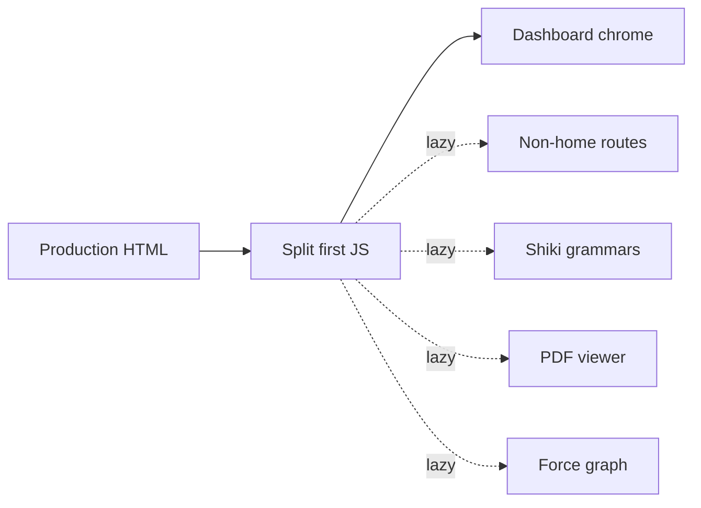

# WebUI first page load

## Overview

First-time load of the GNO WebUI home page ships one fat JavaScript payload. This plan keeps the current client SPA and sequences four pieces of work: emit split chunks on the production serve path, default `gno serve` to that production bundle, lazy-load non-home routes and keep Shiki/PDF/graph off the first file, then measure two bars on one harness (localhost, production serve, cold JS cache).

The 200ms P95 bar is first paint of home chrome (Dashboard shell visible). The 1s P95 bar is TTI (clicks respond). Filled Dashboard health data is neither bar.

## Conversation Evidence

> user (turn 1): "Can you have it capture a spec to address this? P95 performance should load the page first time in 200ms max. Reasonable and achievable metric?"
> user (turn 1, part 2): "this" = first page load of GNO WebUI, from the investigation on SHA b6c7bffe0ba3de22ef4fa260ba43914b947c0934.
> user (turn 1, part 3): User bar: P95 first-time page load ≤ 200ms.
> user (turn 1, part 4): Define "page load" as time from navigation start to first paint of home chrome (Dashboard shell visible), localhost, production serve, cold JS cache. That is the 200ms P95 acceptance criterion.
> user (turn 1, part 5): TTI / Dashboard health data filled in is NOT the 200ms bar. Call that out as a separate, slower budget.
> user (turn 1, part 6): 200ms P95 for a painted shell is achievable after the P0 bundle split. 200ms P95 TTI with the leftover ~3.9 MB home JS is not the same metric and is not claimed.
> user (turn 1, part 7): Serve path must emit split chunks (HTMLBundle today inlines). Route-lazy alone will not help until that is true.
> user (turn 1, part 8): Then lazy non-home routes so Dashboard is not paying for editor/markdown/ask/graph/pdf.
> user (turn 1, part 9): Then shrink Shiki on the home graph (allowlist / delay highlighter).
> user (turn 1, part 10): Default WebUI serve should be production bundle unless explicitly dev/hot.
> user (turn 1, part 11): Optional tiny static skeleton in the HTML shell is cosmetic only; real win is JS weight.
> user (turn 1, part 12): DONE WHEN: P95 ≤ 200ms from navigation start to first paint of home chrome, localhost production, cold JS cache, documented how to measure (N and harness).
> user (turn 1, part 13): Home first JS is a split entry, not one 11.8 MB file. PDF/graph/Shiki grammars are not in that first file.
> user (turn 1, part 14): Default `gno serve` is not the 17 MB dev bundle.
> user (turn 1, part 15): Other flow specs untouched.
> user (turn 1, part 16): Do not implement in capture. Do not mark ready. Do not claim 200ms TTI. Do not change retrieval/KB/MCP. Do not require a live remote tap (unreachable in the investigation).
> user (turn 2): P95 ≤ 200ms is FIRST PAINT of home chrome (navigation start → first paint), localhost, production serve, cold JS cache.
> user (turn 2, part 2): Second bar: P95 TTI (Time to Interactive: clicks respond) ≤ 1s on the same harness. Not 200ms TTI.
> user (turn 2, part 3): No major architectural rewrite. Stay on the current client SPA. Work is: HTMLBundle emits split chunks, lazy non-home routes, Shiki/pdf/graph off the first file, default serve is production bundle. Not SSR, not a new framework, not a rewrite of retrieval/KB.

## Goal & Context

<!-- scope: business -->
<!-- Source-tag breakdown: 85% [user] / 15% [paraphrase] -->

First-time load of the GNO WebUI home page is too heavy. Two bars, same harness (localhost, production serve, cold JS cache):

1. P95 ≤ 200ms from navigation start to first paint of home chrome (Dashboard shell visible). That 200ms bar is first paint only. [user]
2. P95 TTI (Time to Interactive: clicks respond) ≤ 1s. This is not a 200ms TTI bar. [user]

Dashboard health data filled in is not either bar. A painted shell at 200ms P95 is treated as achievable after the first-chunk split. 200ms P95 TTI is a different metric and is not claimed.

The product work is incremental on the current client SPA: stop shipping one fat first JavaScript file, keep non-home features off that file, and make default WebUI serve the production bundle unless the operator asked for dev/hot. No major architectural rewrite. [user]

## Architecture & Data Models

<!-- scope: technical -->
<!-- Source-tag breakdown: 80% [paraphrase] / 20% [user] -->

Stay on the current client-rendered SPA. The HTML shell paints an empty root. Dashboard chrome appears only after the first JavaScript module evaluates. This spec does not introduce server-side rendering or a new UI framework. [user]

The production serve path currently emits one non-split JavaScript payload (investigation-measured about 11.8 MB uncompressed / about 2.4 MB gzip) plus a small CSS file. Default CLI serve is development when the environment is not production (investigation-measured about 17.1 MB JS). Desktop already forces production.

Existing lazy imports on graph and PDF viewers do not reduce first-load bytes while the serve path inlines. The app entry statically binds every route, so even a splitting bundler still puts editor, markdown, ask, graph, and PDF on the home graph until those routes are lazy.

The allowed work is: make the HTMLBundle emit split chunks; then lazy non-home routes; then keep Shiki, PDF, and graph off the first file; then default serve the production bundle unless explicitly dev/hot. [user]

Home first data calls are status endpoints (counts and health), not a vault dump. Chrome may also request model presets. That work can delay filled-in health content; it is not the 200ms first-paint bar and is not the 1s TTI bar.

Syntax highlighting currently value-imports the full language table and creates the highlighter when that module evaluates. Until the serve path emits real split chunks, route-lazy and highlighter delays will not change first-load bytes.

Home chrome for the first-paint bar is the Dashboard header and primary nav (logo, title, Search / Ask / Browse and the other nav buttons). Workspace tabs may already be on screen. HealthCenter, BootstrapStatus, and the status count cards wait on `/api/status` and are outside both bars.

The first JavaScript file is the entry module referenced by the production HTML document (script src), not later lazy chunks and not the CSS file. A document that still inlines the application as one script has no split entry.

## Approach

Sequence is binding. Split on the serve path first. Route-lazy and Shiki work do not count while the production HTML still inlines one chunk.

1. **Production HTML emits split chunks.** Keep the private bundle host and the public security-header proxy. Change the production (`development: false`) path so the HTML document references external JS files and those files are reachable on the public listener. The investigation already showed `bun build --splitting` can emit a smaller entry plus extra files for pdf/graph/Shiki langs. Wire that (or the equivalent HTMLBundler split) into the serve path. Do not introduce Vite, a new framework, or SSR. If production HTML still inlines one ~11.8 MB script after this task, stop and re-evaluate before lazy-route work.
2. **Default `gno serve` is the production bundle.** Add an explicit operator switch for dev/hot (CLI `--dev`, existing `bun --hot` / `serve:dev`). Unset `NODE_ENV` on a plain `gno serve` must not ship the ~17 MB development bundle. Desktop already forces production and stays that way. Detached children inherit the same default. `bun test` may keep `NODE_ENV=test`; do not flip injected unit tests into a surprise production bundle unless they opt in.
3. **Lazy non-home routes, then keep Shiki/PDF/graph off the first file.** Keep Dashboard and the app shell eager. Lazy-load Search, Browse, DocView, DocumentEditor, Collections, Connectors, Ask, GraphView, TraceHistory. Keep `/clipper/pair` on its existing separate render branch. Then stop value-importing the full Shiki language table on the home graph and delay highlighter creation until a code block actually highlights. Assert the first JS file is a split entry and does not contain PDF viewer, force-graph, or Shiki grammar payloads.
4. **Measure both bars on one harness.** Playwright against localhost production serve, cold JS cache, documented N (default 20 cold loads unless noise forces a recorded increase). First paint is navigation start to Dashboard shell visible (`h1` GNO plus the Search nav button). TTI is navigation start to a Search click that starts in-app navigation to `/search`. Publish N, selectors, cache rule, and P95 math next to the script. Do not wait on HealthCenter.



## Quick commands

```bash
bun test test/serve/spa-bundle-source.test.ts test/cli/serve-flags.test.ts
bun test test/serve/public/code-language.test.ts test/serve/public/navigation.test.tsx
bun test test/serve/security.test.ts
# After the harness task lands (name may match the implementer's script):
# bun scripts/webui-first-page-load.ts
```

## Edge Cases & Constraints

<!-- scope: technical -->

- The 200ms P95 bar applies only to first paint of home chrome (navigation start → first paint), localhost, production serve, cold JS cache. [user]
- The second bar is P95 TTI (clicks respond) ≤ 1s on that same harness. It is not a 200ms TTI bar. [user]
- Dashboard health data filled in is a separate, slower budget and is not either bar. [user]
- 200ms P95 TTI is not claimed. [user]
- Route-lazy does not count as done while the serve path still inlines a single chunk. [paraphrase]
- Delivery stays on the current client SPA: no SSR, no new framework, no major architectural rewrite. [user]
- Retrieval, knowledge-base, and MCP behavior are out of scope. [user]
- A live remote tap is not required to accept this spec. [user]
- Default WebUI serve is production unless the operator explicitly requested dev/hot. [user]
- An optional tiny static skeleton in the HTML shell is cosmetic only; it does not satisfy the 200ms bar. [user]
- Measurement must record N and the harness so two reviewers can repeat the same P95 for both bars. [user]
- `/clipper/pair` keeps its existing separate render branch and is outside the home first-paint bar.
- A detached `gno serve --detach` child inherits the production default unless the parent was started with the explicit dev/hot switch.
- Production HTML cache, if kept, must still serve a split document plus reachable chunk URLs. A cached inlined monolith fails R3 and R5.
- Windows private bundle host (ephemeral loopback) and Unix socket host must both serve every chunk URL the HTML references.
- `bun test` typically sets `NODE_ENV=test`. Production-bundle assertions must opt into production explicitly. The CLI default is a `gno serve` process, not the unit-test process.
- Production CSP stays `script-src 'self'` with no `ws:` connect-src. Split chunks must be same-origin.

## Acceptance Criteria

<!-- scope: both -->

- **R1:** P95 of first-time page load is ≤ 200ms, measured from navigation start to first paint of home chrome (Dashboard shell visible), on localhost, production serve, cold JS cache. [user] Errors: server unreachable, missing shell selector, or a warm JS cache → harness exits non-zero and does not publish a P95. Do not count a sample that used cached JS.
- **R2:** The measurement method documents N and the harness used. [user] Errors: missing N, missing cache rule, or missing selectors → R2 fails. No other error surface.
- **R3:** Home first JavaScript is a split entry, not a single ~11.8 MB file; PDF, graph, and Shiki grammars are absent from that first file. [paraphrase] Errors: HTML still inlines the app as one script, the first file is still the monolith, or pdfjs / `react-force-graph-2d` / Shiki language payloads appear in that file → fail.
- **R4:** Default `gno serve` does not ship the ~17 MB development bundle. [user] Errors: a start without `--dev`/`--hot` and without `NODE_ENV=production` still serves the development bundle → fail. `--dev` combined with `--status` or `--stop` does not apply (those paths do not boot the UI). Detached child missing the production default → fail.
- **R5:** The WebUI serve path emits split chunks; route-lazy alone does not satisfy this while the serve path inlines. [paraphrase] Errors: a chunk URL in the HTML 404s on the public listener → fail. Route-lazy merged while HTML still inlines one chunk does not satisfy R5.
- **R6:** Non-home routes load after home so Dashboard does not pay for editor, markdown, ask, graph, or PDF on first paint. [paraphrase] Errors: first file still contains those page modules → fail. Unknown path keeps today's Dashboard fallback.
- **R7:** Syntax highlighting on the home graph uses an allowlist or delayed highlighter so unused grammars are not in the first file. [paraphrase] Errors: unused grammars still in the first file → fail. Unknown fence language keeps the existing `text` fallback and must not throw.
- **R8:** P95 TTI (Time to Interactive: clicks respond) is ≤ 1s on the same harness as R1 (localhost, production serve, cold JS cache). This is not a 200ms TTI bar. [user] Errors: missing click target or no observed navigation response → harness exits non-zero and does not publish a TTI P95. A 200ms TTI miss is not an R8 failure.
- **R9:** Delivery stays on the current client SPA: HTMLBundle split chunks, lazy non-home routes, Shiki/PDF/graph off the first file, default production serve. Not SSR and not a new framework. [user] Errors: adding SSR, Vite, or a replacement UI framework fails this spec. No other error surface.

## Boundaries

<!-- scope: business -->

- Do not claim 200ms P95 time-to-interactive or 200ms P95 for Dashboard health data filled in. [user]
- Do not change retrieval, knowledge-base, or MCP behavior. [user]
- Do not require a live remote tap to measure or accept. [user]
- Do not modify other flow specs. [user]
- Do not treat an optional HTML skeleton as the performance win. [user]
- Do not expand this spec into Browse-tree, autocomplete, or other non-home surfaces. [paraphrase]
- Do not perform a major architectural rewrite: no SSR, no new framework, no replacement of the current client SPA. [user]
- Do not restyle or re-open the fn-112 PDF renderer, vendor routes, or Range contract.
- Do not add a mandatory CI perf gate on this spec. The harness is documented and repeatable. CI inclusion is optional only if it stays stable.
- Do not split WorkspaceTabs, QuickSwitcher, or AIModelSelector unless the harness fails after split + route-lazy + Shiki work.
- Do not optimize `/clipper/pair` in this spec.

## Decision Context

<!-- scope: both — conditionally substructured -->

### Motivation
<!-- scope: business -->

- Success is two bars on one harness: P95 ≤ 200ms to a painted home shell, and P95 TTI (clicks respond) ≤ 1s. Neither is a filled health panel. [user]
- Sequence the work: emit split chunks on the serve path, then lazy non-home routes, then shrink highlighting / keep PDF and graph off the first file. [paraphrase]
- JavaScript weight is the real win; a static skeleton is optional and cosmetic. [user]
- A 200ms painted shell is treated as achievable after the first-chunk split; a 200ms TTI claim is rejected in favor of the 1s TTI bar. [user]
- Stay on the current client SPA. Incremental bundle and route-lazy work; not a rewrite. [user]

### Implementation Tradeoffs
<!-- scope: technical -->

- Rejected SSR and a new bundler/framework. The investigation already produced a split with `bun build --splitting` on this SPA. The serve path must emit those files. It does not need a new architecture.
- Rejected treating existing `React.lazy` on PdfViewer and ForceGraph2D as done. Those imports stay inside statically imported page modules, and the production HTMLBundle still inlines.
- Rejected flipping `startServer` for every `NODE_ENV=test` unit test. The R4 default is the `gno serve` CLI process. Injected tests keep today's `NODE_ENV` behavior unless they opt into production.
- Rejected a cosmetic HTML skeleton as the proof. First paint is React Dashboard chrome after the first JS evaluates.
- Rejected a live remote tap and a required CI perf gate. Localhost + documented N is the contract.
- Default N is 20 cold loads (P95 = 19th of 20 sorted samples, nearest-rank). The harness may raise N and must record the new N if noise demands it.

## Early proof point

Task fn-124-webui-first-page-load.1 proves the production serve path can emit split chunks and serve every chunk URL through the existing private-bundle proxy. If the HTML is still one inlined ~11.8 MB script, stop. Do not spend the route-lazy or Shiki tasks on a no-op.

## Parked unknowns

- No numeric budget is set for Dashboard health data filled in. Resolve only if a later spec takes that bar.

## Requirement coverage

| Req | Description | Task(s) | Gap justification |
|-----|-------------|---------|-------------------|
| R1 | P95 ≤ 200ms first paint of home chrome | fn-124-webui-first-page-load.4 | — |
| R2 | Document N and harness | fn-124-webui-first-page-load.4 | — |
| R3 | Split first JS; no PDF/graph/Shiki grammars | fn-124-webui-first-page-load.1, fn-124-webui-first-page-load.3 | .1 emits the split; .3 proves the first file is clean |
| R4 | Default serve is not the 17 MB dev bundle | fn-124-webui-first-page-load.2 | — |
| R5 | Serve path emits split chunks | fn-124-webui-first-page-load.1 | — |
| R6 | Lazy non-home routes | fn-124-webui-first-page-load.3 | — |
| R7 | Highlight allowlist or delayed highlighter | fn-124-webui-first-page-load.3 | — |
| R8 | P95 TTI (clicks respond) ≤ 1s, same harness | fn-124-webui-first-page-load.4 | — |
| R9 | Stay on current client SPA | fn-124-webui-first-page-load.1, fn-124-webui-first-page-load.2, fn-124-webui-first-page-load.3, fn-124-webui-first-page-load.4 | Constraint on every task |

## References

- Investigation SHA `b6c7bffe0ba3de22ef4fa260ba43914b947c0934` (production inline ~11.8 MB JS / ~2.4 MB gzip; `bun build --splitting` ~3.86 MB entry; default CLI serve ~17.1 MB unless `NODE_ENV=production`)
- `docs/WEB-UI.md` Command Line Options and `NODE_ENV=production`
- `spec/cli.md` `gno serve` synopsis
- `docs/adr/001-scholarly-dusk-design-system.md` (home chrome tokens; no visual redesign in this spec)
